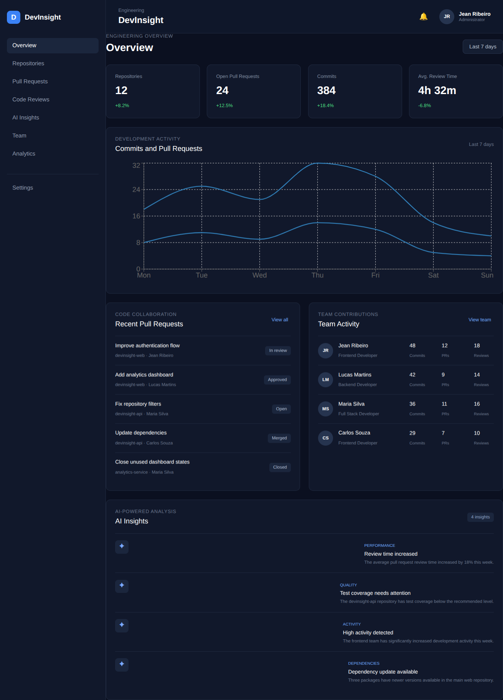

<div align="center">

# 🧠 DevInsight

### AI SaaS Dashboard for Engineering Analytics

A modern, responsive engineering analytics dashboard built with **React, TypeScript, React Router, and Recharts**.

DevInsight provides a centralized interface for monitoring repositories, pull requests, code reviews, team activity, engineering analytics, code quality, risks, and AI-style recommendations.

<br />


<br />

**[Live Demo](https://devinsight.vercel.app/)** · **[GitHub Repository](https://github.com/JeanRibeiro8/devinsight)**

</div>

---

## 📸 Preview

<div align="center">

### Dashboard Preview



</div>

> **Live Demo:** [https://devinsight.vercel.app/]
> **Repository:** [https://github.com/JeanRibeiro8/devinsight]

---

## 📌 About the Project

**DevInsight** is a frontend-focused **engineering analytics dashboard** designed to simulate an internal SaaS platform used by software development teams.

The platform brings development information into a single interface, allowing teams to monitor repositories, pull requests, code reviews, contributors, activity trends, quality indicators, risks, and project evolution.

The current version uses **local/mock data** and simulated AI recommendations. It does not currently connect to GitHub, a backend, database, or real AI service.

The application was designed with future integrations in mind, making it possible to evolve the frontend toward a more complete engineering intelligence platform.

> **Portfolio focus:** React architecture, TypeScript, data-driven interfaces, routing, state management, filtering, data visualization, and responsive UI development.

---

## ✨ Features

### 📊 Overview Dashboard

* Total repositories
* Open pull requests
* Approved pull requests
* Commit overview
* Average review time
* Team activity
* Development activity charts
* Pull request overview
* Team activity visualization
* AI-style recommendations

### 📦 Repositories

* Repository listing
* Repository search
* Filter by status
* Filter by programming language
* Repository activity information
* Contributors
* Pull request information
* Last update
* Test coverage
* Activity level

### 📁 Repository Details

* Repository summary
* Technology information
* Recent activity
* Pull requests
* Commits
* Contributors
* Issues
* Quality metrics
* Technical debt information
* Dynamic repository routes

### 🔀 Pull Requests

* Pull request listing
* Filter by status
* Filter by author
* Filter by repository
* Empty states
* Clear filters

### 👀 Code Reviews

* Reviews awaiting action
* Completed reviews
* Review comments
* Average review time
* Most modified files
* Attention points
* Review status filtering

### 🤖 AI Insights

* Development recommendations
* Code quality insights
* Repository risks
* Team observations
* Project observations
* Mock AI-generated recommendations

> **Note:** AI Insights currently use realistic mock recommendations for demonstration purposes. No real AI API is connected in the current version.

### 👥 Team

* Team members
* Contributions
* Commits
* Pull requests
* Code reviews
* Related projects
* Recent activity

### 📈 Analytics

* Commits by period
* Pull requests opened and merged
* Review time
* Repository activity
* Programming language distribution
* Project evolution
* Data visualization with Recharts

### ⚙️ Settings

* Dashboard preferences
* Notification settings
* Interface preferences

---

## 🛠️ Tech Stack

| Technology                  | Purpose                                                              |
| --------------------------- | -------------------------------------------------------------------- |
| **React**                   | Building the application interface through reusable components       |
| **TypeScript**              | Defining structured data and improving type safety                   |
| **Vite**                    | Development environment and production build tooling                 |
| **React Router**            | Client-side navigation and dynamic repository routes                 |
| **Recharts**                | Creating interactive engineering analytics visualizations            |
| **CSS3**                    | Styling, layouts, responsive behavior, and interface design          |
| **JavaScript / TypeScript** | Application logic, data transformation, filtering, and state updates |

---

## ⚛️ React & TypeScript Concepts Practiced

DevInsight was built as both a portfolio project and a practical environment for strengthening modern frontend development skills.

### React

* Component-based architecture
* Reusable components
* Props
* `useState`
* `useMemo`
* `useParams`
* Conditional rendering
* State updates
* Form handling

### TypeScript

* Interfaces
* Types
* Typed component props
* Structured application data
* Consistent data models
* Type-safe state management

### Data Processing

The project uses JavaScript and TypeScript array methods throughout the application, including:

* `map()`
* `filter()`
* `reduce()`
* `sort()`
* `find()`
* `includes()`

These are used for operations such as transforming data, calculating dashboard information, searching repositories, filtering results, and organizing analytics.

### Routing

React Router is used to create the application's navigation structure.

Dynamic routes are used for repository detail pages, with `useParams()` retrieving the repository identifier from the URL.

### Performance & State

`useMemo()` is used where appropriate to memoize derived data, such as filtered repository results, avoiding unnecessary recalculation during unrelated renders.

### Responsive Development

The interface was designed to adapt to desktop and smaller screens using responsive CSS techniques and reusable layout components.

---

## 🧩 Project Structure

The project follows a component-based architecture with clear separation between UI components, pages, application data, and types.

```text
src/
├── components/
├── data/
├── pages/
├── types/
├── App.tsx
├── index.css
└── main.tsx
```

### `components/`

Contains reusable interface components used across different parts of the application.

### `data/`

Contains the local/mock data used by the current frontend version.

### `pages/`

Contains the application's main page-level views, such as the dashboard, repositories, repository details, pull requests, reviews, analytics, team, and settings.

### `types/`

Contains TypeScript interfaces and types used to keep application data consistent.

### `App.tsx`

Acts as a central point for the application's structure and routing.

### `index.css`

Contains global styling and responsive design rules.

### `main.tsx`

Entry point responsible for rendering the React application.

---

## 🔄 Application Architecture

At a high level, DevInsight follows a data-driven frontend flow:

```text
Local / Mock Data
       │
       ▼
   React State
       │
       ├───────────────┐
       ▼               ▼
  Filtering        Data Processing
       │               │
       └───────┬───────┘
               ▼
        Reusable Components
               │
        ┌──────┴──────┐
        ▼             ▼
      Tables        Charts
        │             │
        └──────┬──────┘
               ▼
          User Interface
```

This structure keeps data processing and presentation organized while allowing the application to be extended with external data sources in the future.

---

## 🧗 Development Challenges & Solutions

### 🔎 Managing Multiple Filters

Repositories and pull requests can be filtered using multiple criteria simultaneously.

**Approach:**
Filtering logic was organized around array methods such as `filter()` and `includes()`, allowing multiple conditions to be applied while keeping the UI state separate from the displayed results.

---

### 🧩 Keeping Filtering Logic Readable

As filtering requirements increased, placing all logic directly inside JSX could make components harder to maintain.

**Approach:**
Derived data was separated from the presentation logic, with `useMemo()` used where appropriate for memoizing filtered repository data.

---

### ♻️ Creating Reusable Dashboard Components

The dashboard contains repeated interface patterns such as metrics, cards, tables, indicators, and activity sections.

**Approach:**
Common UI patterns were implemented as reusable React components instead of duplicating markup across pages.

---

### 🛣️ Dynamic Repository Routes

Repository details need to be displayed based on the repository selected by the user.

**Approach:**
React Router dynamic routes are used together with `useParams()` to retrieve the repository identifier and display the corresponding data.

---

### 📊 Displaying Structured Engineering Data

The application contains different types of development information, including commits, pull requests, reviews, contributors, quality metrics, and activity.

**Approach:**
The data was organized into structured TypeScript types and transformed using array methods before being presented through UI components and charts.

---

### 📈 Building Data Visualizations

Engineering analytics are easier to understand when trends can be represented visually.

**Approach:**
Recharts was used to transform structured data into dashboard visualizations for activity, pull requests, commits, review time, and other analytics.

---

### 🏗️ Organizing a Larger React Application

With multiple pages and interconnected features, keeping the project organized became increasingly important.

**Approach:**
The application was structured around pages, reusable components, local data, types, and routing responsibilities to make the codebase easier to navigate and extend.

---

## 🚀 Getting Started

### Prerequisites

Make sure you have **Node.js** and **npm** installed.

### 1. Clone the repository

```bash
git clone https://github.com/JeanRibeiro8/devinsight.git
```

### 2. Navigate to the project

```bash
cd devinsight
```

### 3. Install dependencies

```bash
npm install
```

### 4. Start the development server

```bash
npm run dev
```

Vite will provide the local development URL in the terminal.

### 5. Build for production

```bash
npm run build
```

Creates an optimized production build of the application.

### 6. Run the linter

```bash
npm run lint
```

Checks the project for code-quality and linting issues.

---

## 🔮 Future Improvements

The current version is intentionally focused on frontend development using local/mock data.

Possible future improvements include:

* GitHub API integration
* Real repository data
* Backend API
* Authentication
* Database integration
* Persistent application data
* Real AI integration
* Real code-quality analysis
* Real-time development activity
* Advanced engineering analytics
* Role-based access control
* More detailed repository metrics
* Automated testing

These features are potential next steps rather than functionality currently implemented in the project.

---

## 📚 What I Learned

DevInsight gave me practical experience building a larger, data-driven React application rather than working with isolated components or simple pages.

The project reinforced my understanding of:

* **React component architecture** through reusable dashboard and page components
* **TypeScript** through structured interfaces and application data
* **React Hooks** through state, memoized data, and dynamic routes
* **Routing** through multiple application views and repository detail pages
* **State management** through interactive filters and UI controls
* **Data filtering and transformation** through `map`, `filter`, `reduce`, `sort`, and `includes`
* **Data visualization** through Recharts
* **Responsive UI development** through adaptive layouts and CSS
* **Frontend architecture** through separation of pages, components, data, and types

Most importantly, the project helped me practice thinking about a frontend application as a connected system, where **data, state, routing, reusable components, and presentation need to work together consistently**.

---

## 👨‍💻 Author

<div align="center">

### Jean Ribeiro

**Junior Web Developer | Frontend**

🇧🇷 Brazil · 🌎 Open to International Remote Opportunities

This project was built as part of my **frontend development portfolio**, with a focus on strengthening my React and TypeScript skills through a realistic SaaS-style application.

<br />

[](https://jeanribeiro8.github.io/JeanRibeiro/)
[](https://github.com/JeanRibeiro8)
[](https://www.linkedin.com/in/jean-ribeiro-9a3792267/)
[](jeanrsantos10@gmail.com)

</div>
---

<div align="center">

**DevInsight** · React + TypeScript + Recharts

Built as a frontend portfolio project by **Jean Ribeiro**

</div>
